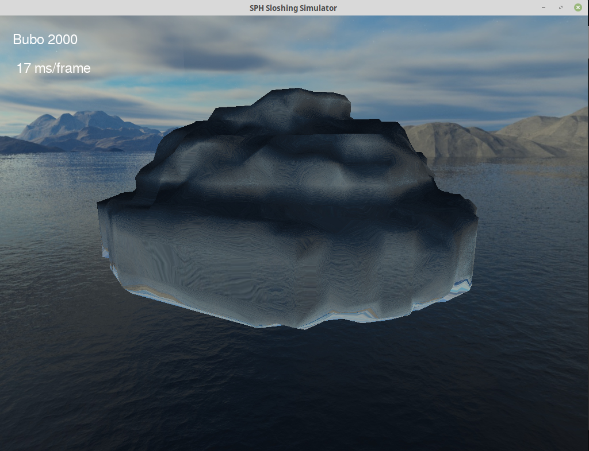

# SPH-Solver
## About
Simple sph-fluid solver utilizing OpenGL

## Build Instructions

*Disclaimer:* So far, I have only tested it on my Linux Ubuntu 18.14 machine. Further tests are in preparation.

Clone this repository and switch into the repository's root directory.

    > mkdir build/
    > cd build/
    > cmake ..
    > make 

The program can be launched by 

    >./sphSolver

